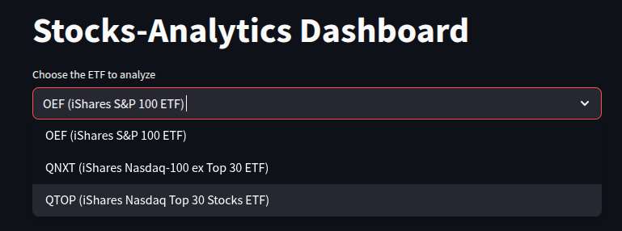
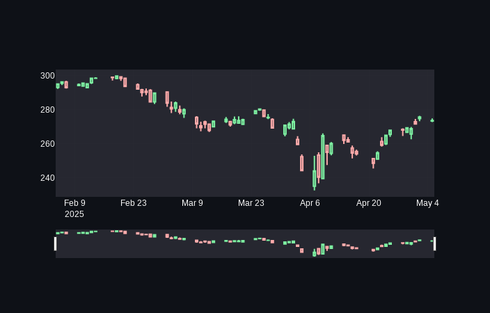
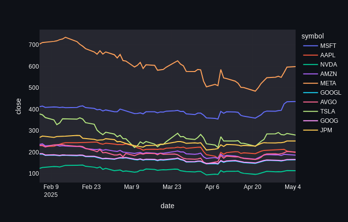
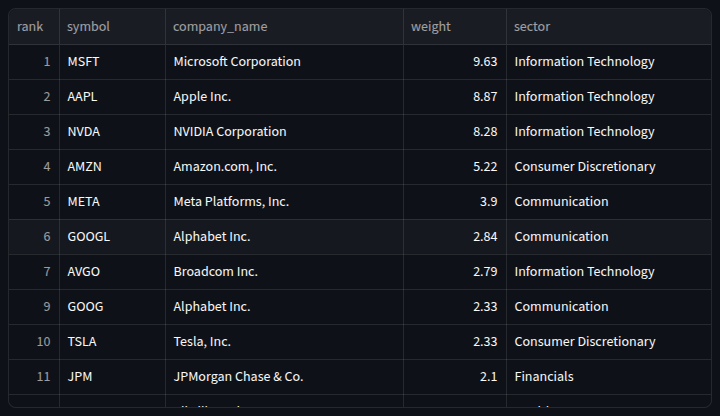
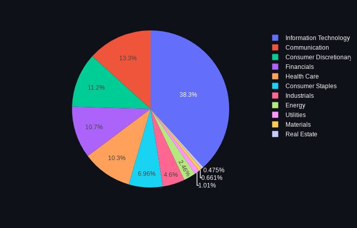
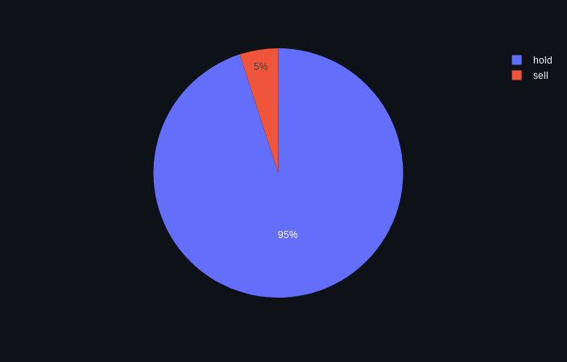
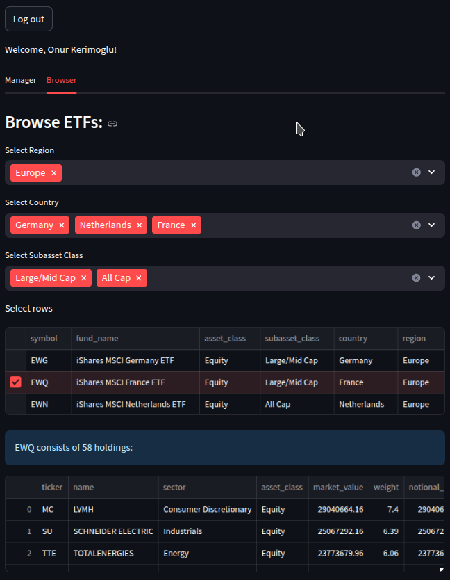

<h1 align="center">
    <strong>Stocks Analytics Dashboard</strong>
</h1>

This is the dashboard component of the [stocks-analytics](https://github.com/OnurKerimoglu/stocks_analytics) project. Check it out: [https://stocks-analytics-dashboard.streamlit.app/](https://stocks-analytics-dashboard.streamlit.app/).

Below, a brief description of the dashboard contents, and setup instructions are provided to facilitate potential repurposing.

# Pages

## Dashboard Page
The first step is to choose one of the tracked ETFs to analyze:

Here, the list of ETFs tracked by the current user will be pulled from a Bigquery table (in stocks-analytics project, see the intro) that contains the tracked ETF symbols, and provided as options. Rest of the panels will be refreshed according to the chosen symbol.

**90 days history**:    
This is a classical [candlestick chart](#https://en.wikipedia.org/wiki/Candlestick_chart) of the ETF being analyzed for the past 90 days: 

**90 days history of top holdings**:  
These are time series plots of the most important (by weight) 10 tickers for the past 90 days:

**Holding Weights**:  
This is a table that shows the holding weights tracked by the ETF, sorted by their weight, in descending order:

**Sectoral Composition**:  
This pie chart is based on the cumulative weights of sectors of holdings tracked by the ETF:

**Bollinger Recommendation for Holdings**:  

This pie chart reflects the counts of tickers for each [Bollinger Band]() recommendation class:

## Admin Page
Admin page can be accessed ony after a succesful login, meaning that the email provided by the user needs match one of the admin emails in the secrets file, under the `[global]` block (see: [Streamlit Secrets](#streamlit-secrets)). Two Tabs are available: Manager and Browser.

### Manager Tab
Under this tab, tracked ETFs (by the currently authenticated admin) can be managed, i.e., currently tracked ETFs can be removed and new ETFs can be added:

### Browser Tab
Under this tab, ETFs can be browsed, sequentially filtered according to the region, country and asset class:

# Setup Instructions

## streamlit secrets

For locally running the app, streamlit requires a secrets.toml under the .streamlit directory (see: [.streamlit/secrets_example.toml](.streamlit/secrets_example.toml) -never commit the real one!). For the deployed app, instead of this file, secrets should be set on [share.streamlit.io](http://share.streamlit.io) under Settings -> Secrets with the same content as in the provided example. Here a brief explanation of each field here:

`[gcp_service_account_viewer]`  
Here the contents of a GCP service account key (see: [https://cloud.google.com/iam/docs/keys-create-delete](https://cloud.google.com/iam/docs/keys-create-delete)) with read permissions needs to be copied. This is required for the regular (non-admin) users to view the dashboards, which require access to Bigquery datasets.

`[gcp_service_account_admin]`  
Similar to above, but this time the contents of a service account key with admin permissions. This is required for some admin functionalities (see below).

`[auth]`  
This is required for the login functionality (see: [https://docs.streamlit.io/develop/concepts/connections/authentication](https://docs.streamlit.io/develop/concepts/connections/authentication)).

`[security]`  
This is where admin usernames or emails can be provided (depending on the authentification method).

`[global]`  
Here the environment (`dev`/`prod`) is defined (see below, the [Cloud Environment](#cloud-environment)).

## Cloud Environment
The app will access the cloud resources based on the definitions in [config/dwh.yaml](config/dwh.yaml). While the table names are environment-agnostic, the datasets are specified for each environment (so far `dev` and `prod`). The environment needs to be defined under [streamlit secrets](#streamlit-secrets), under the `[global]` block.
